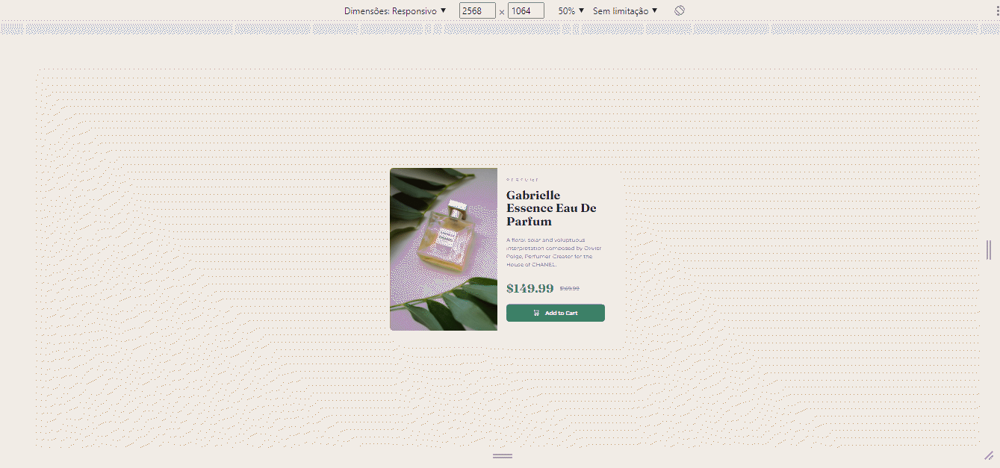

# Projeto Frontend Mentor | Stats preview card component

## Descrição
    Esta é a solução do desafio do site Front End Mentor, visando reproduzir um Cartão de produto o mais fiel possível, trabalhando com as linguagens descritas abaixo.

## Meu Processo

    •	Marcação semântica HTML5
    •	Propriedades personalizadas de CSS3
    •	Flex Box
    •	Design responsivo

## Design

### Desktop

### Responsivo

### Gif de Funcionalidade
    

## Autor
 GitHub: <a href="https://github.com/kelvincharlesdev">Kelvincharlesdev</a>  
FrontEndMentor: <a href="https://www.frontendmentor.io/profile/kelvincharlesdev">@kelvincharlesdev</a>  
LinkedIn: <a href="https://www.linkedin.com/in/kelvin-charles/"> Kelvin Charles Cruz </a>